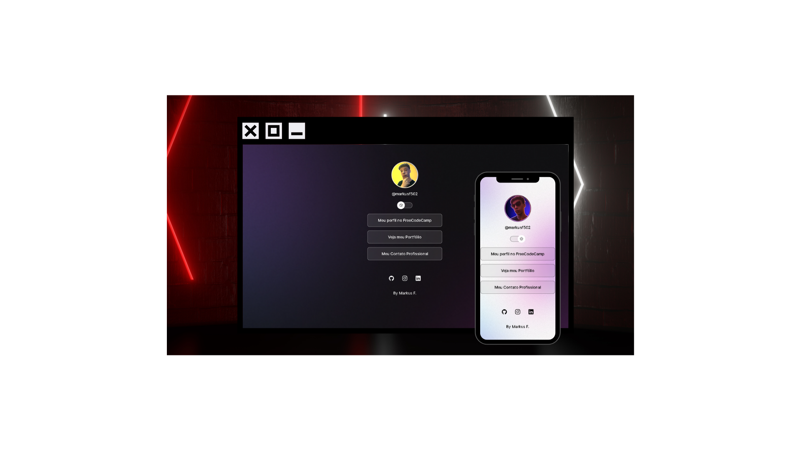

<h1 align="center"> MarksLink's </h1>

Meu Primeiro projeto que utiliza Programação!

  

 

  

<h2>Tecnologias</h2>

Esse projeto foi desenvolvido com as seguintes tecnologias:

- HTML e CSS
- JavaScript
- Git e Github
- Figma

<h2> Projeto</h2>

O MarkLink's é um agregador de links para usar como cartão de visitas online.

- [Acesse o projeto finalizado, online](https://maykbrito.github.io/devlinks)

## Licença

Esse projeto está sob a licença MIT.

---

By Markus F.
